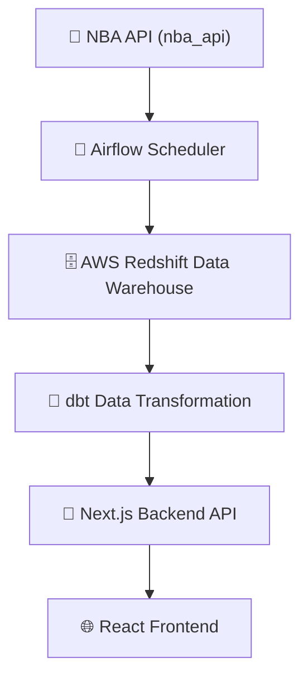

# 📘 The Data Project

The data project is web app that contains data analytics and semantic search systems covering multiple domains:

- **📈 Stock Analytics and Similarity Search**
- **🏀 Sports Data Insights**
- **🌍 Geographic Data and Visualizations**
- **🏥 Healthcare Insurance Data Processing**

Each domain is individually documented below.

---

## 📖 Table of Contents

- [📈 Stock Analytics and Similarity Search](#-stock-analytics-and-similarity-search)
  - [Data Sources](#data-sources)
  - [Data Processing](#data-processing)
  - [Semantic Search Architecture](#semantic-search-architecture)
- [🏀 Sports Data Insights](#-sports-data-insights)
  - [Data Sources](#sports-data-sources)
  - [Analysis and Visualizations](#sports-analysis-and-visualizations)
- [🌍 Geographic Data and Visualizations](#-geographic-data-and-visualizations)
  - [Geographic Data Sources](#geographic-data-sources)
  - [Mapping and Visualizations](#mapping-and-visualizations)
- [🏥 Healthcare Insurance Data Processing](#-healthcare-insurance-data-processing)
  - [Data Sources](#healthcare-data-sources)
  - [Claims and Data Extraction](#claims-and-data-extraction)
---

## 📈 Stock Analytics and Similarity Search

### Data Sources
- **Alpha Vantage API**: Company descriptions, financial metrics, and historical stock prices.

### Semantic Search Architecture

## 🏀 Sports Data Insights

